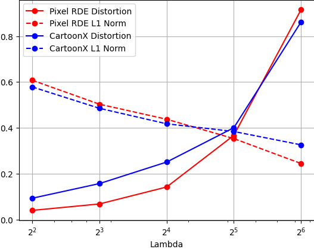

# FACTAI_CartoonX

## Running The script for figure 5a and 5b

```
python project/figure_generator_main_fig568.py --imgdir=examples/example_images --logdir=results/figure_5 --resize_images --figure_name=5a

python project/figure_generator_main_fig568.py --imgdir=examples/example_images --logdir=results/figure_5 --resize_images --figure_name=5b
```

## Running The script for figure 6a and 6b

```
python project/figure_generator_main_fig568.py --imgdir=examples/example_images --logdir=results/figure_6 --resize_images --figure_name=6a

python project/figure_generator_main_fig568.py --imgdir=examples/example_images --logdir=results/figure_6 --resize_images --figure_name=6b
```
## Running The script for figure 7c

```
python project/7c_experiment.py --imgdir=examples/example_images --logdir=results/figure_7 --resize_images
```




## Running The script for figure 8a, 8b, 8c, and 8d

```
python project/figure_generator_main_fig568.py --imgdir=examples/example_images --logdir=results/figure_8 --resize_images --figure_name=8a

python project/figure_generator_main_fig568.py --imgdir=examples/example_images --logdir=results/figure_8 --resize_images --figure_name=8b

python project/figure_generator_main_fig568.py --imgdir=examples/example_images --logdir=results/figure_8 --resize_images --figure_name=8c

python project/figure_generator_main_fig568.py --imgdir=examples/example_images --logdir=results/figure_8 --resize_images --figure_name=8d
```


## Running the script for the obfuscation experiment

```
python project/obfuscation_scaling_experiment.py --imgdir=examples/example_images --logdir=results/obfuscation_scaling_experiment --resize_images
```


## Running CartoonX on Semantic Segmentation

```
Run the Semantic_Segmentation.ipynb inside Semantic_Segment
```

<table>
  <tr>
    <td>
      
    </td>
    <td>
      
    </td>
    <td>
      
    </td>
  </tr>
  <tr>
    <td>
      
    </td>
    <td>
      
    </td>
    <td>
      
    </td>
  </tr>
</table>

## Running CartoonX on Object Detection

```
Run the Yolo.ipynb inside YOLO/yolov5-gradcam/
```


## Generating figure 7a and 7b

```
Run the 7a_7b_reproduce/Plot_all_7a.ipynb and 7a_7b_reproduce/Plot_all_7b.ipynb respectively
Move all the obtained npy files to 7a_7b_reproduce/saved_npy folder.
Run the 7a_7b_reproduce/Visualize_Plots.ipynb 
```


## Visualizing 7a and 7b

```
Run the 7a_7b_reproduce/Visualize_Plots.ipynb 
```
## Running the script for the model extension experiment

For plotting the results of the model extension experiment, run CartoonX_model_ext/project/Plot_Model.ipynb notebook.


For plotting the CartoonX explanations for different models on a sample image, run CartoonX_model_ext/demo.ipynb notebook.


